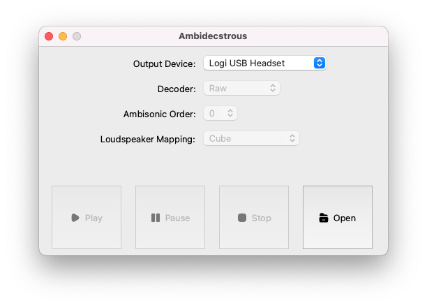

# Ambidecstrous
Simple GUI application for decoding Ambisonic-format audio files 
to loudspeaker rig. Presently includes support for:
* Raw playback (no decoding)
* [Stereo UHJ][1]
* [ACN/SN3D][2] up to fourth-order
* Octagon / Cube 16-channel loudspeaker layout

Future versions will include support for Furse-Malham format and additonal
loudspeaker layouts.

### Running the application
This project uses [poetry][3] for package management. Install this if you don't
have it, then `poetry install` to set up a virtual environment with all 
dependencies. In the project's base directory, run `poetry shell` to activate
the venv, then `python ambidectrous/main.py` to run the GUI:

Opening an audio file will enable the various decoder menu options depending on
what is available given the input audio channels. Note that, for testing,
the decoder will output to any selected audio device, even if there are not
enough channels available to match the loudspeaker mapping specification. The
output will be truncated to the number of output channels available.

#### Custom loudspeaker layouts
It is possible to add custom loudspeaker layouts by adding specifications to
the `mappings/` directory, matching the data format of the existing json files.

[1]: https://en.wikipedia.org/wiki/Ambisonic_UHJ_format
[2]: https://en.wikipedia.org/wiki/Ambisonic_data_exchange_formats#ACN
[3]: https://python-poetry.org/